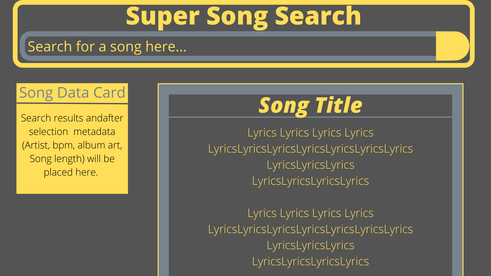

# Project title: Super-Song-Search

## Description: Super Song Search is a simplified application for musicians to be able to search for song tablature/notation as well as corresponding lyric sheets.

## User Story
### AS A MUSICIAN I want to be able to quickly search this app for tablature/notation and lyrics
### SO THAT I can use these resources to learn/play songs quickly in a variety of settings

## Acceptance Criteria
### GIVEN there is a search bar and a selector for instruments
### WHEN I search for a song or artist
### WHEN I am presented with options matching my search inquiry
### GIVEN that there are options when I select a song
### WHEN I select a song
### THEN I am presented with a side by side view of lyrics and tablature notiation

API:s 
Songster API and Genius API

## Wireframing

1/25/2022 temporary issue outline:
Create initial html/css/js files
Create the header and footer
Place search and select options in header
Create modal for search options
Append song information into two separate columns (tabs and lyrics)

